# UWUE (unbeatable windsurfer uh eh)
Java 3d game engine created for small games with retro graphics. (altho PBR is also possible)  
Uses LWJGL, GLFW, OpenGL 3, OpenAL, Luaj, STB, JOML.  
Suports materials with shaders, 3D audio, lua scripting, non-linear dialogues.  

 
  
PBR Demo

  
  
  
  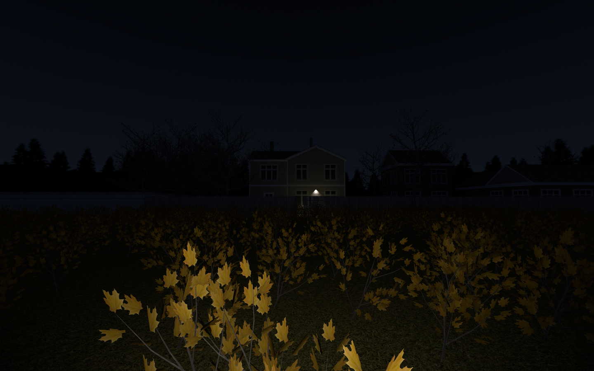
  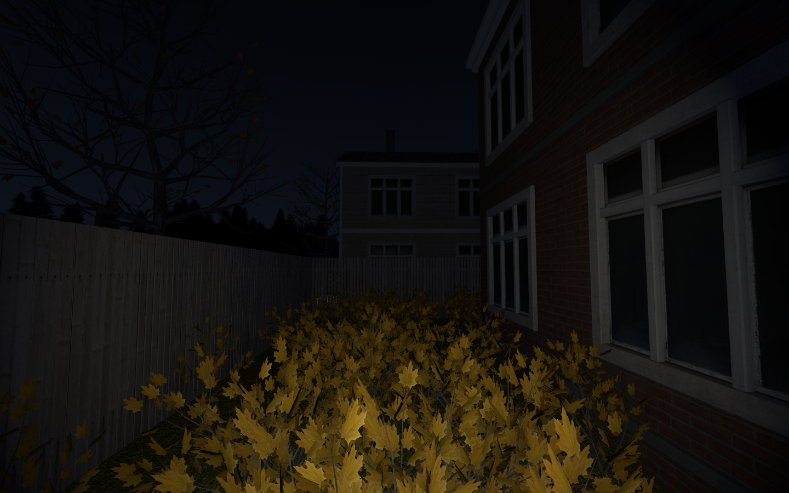
  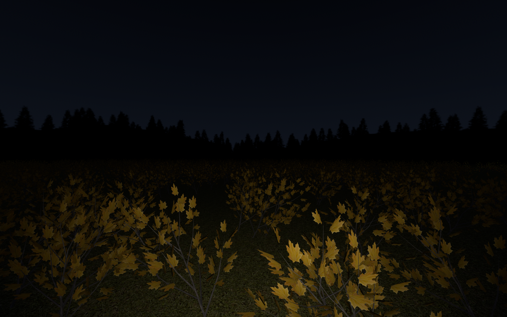

  
# Games using UWUE  
[BIZARRE DREAM BAZAAR (Carpet Edition)](https://samael-kethill.itch.io/bizarre-dream-bazaar-carpet-edition) 

 
  
Screenshots

  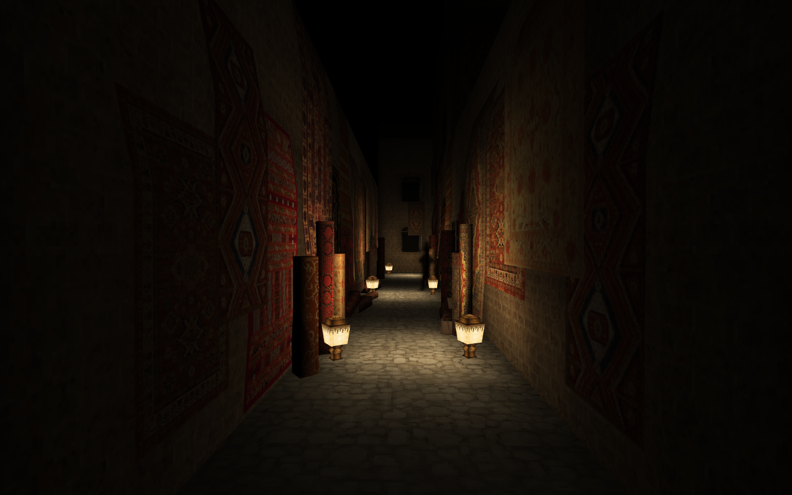
  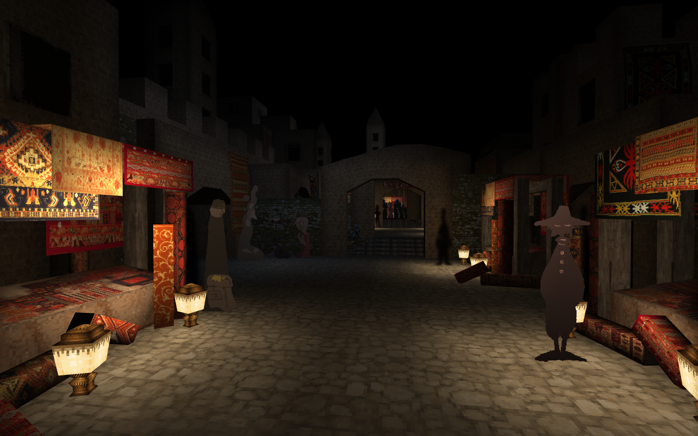
  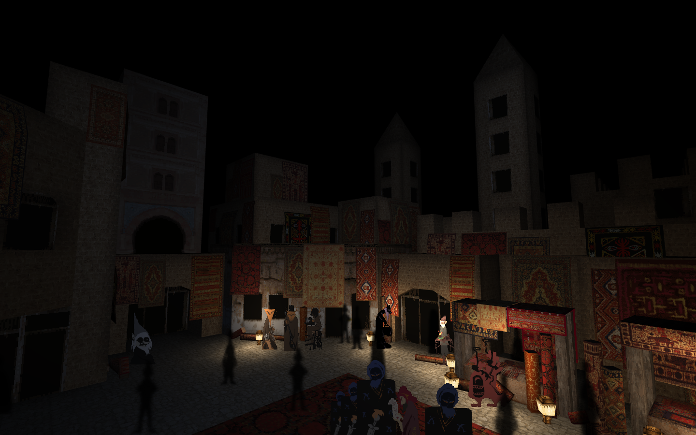
  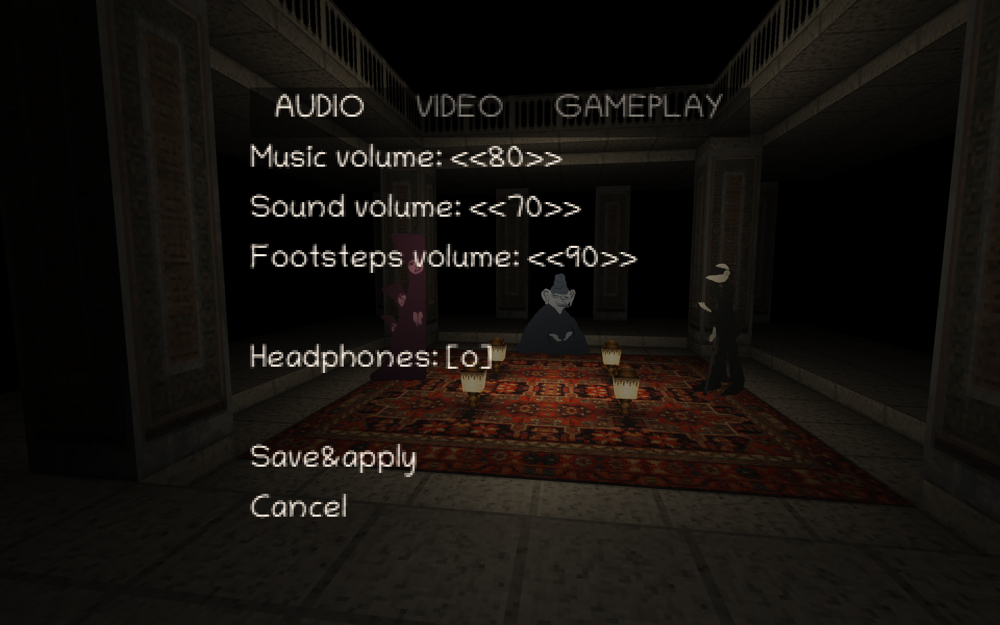

[Whose dream is it?](https://samael-kethill.itch.io/whose-dream-is-it)  

 
  
Screenshots

  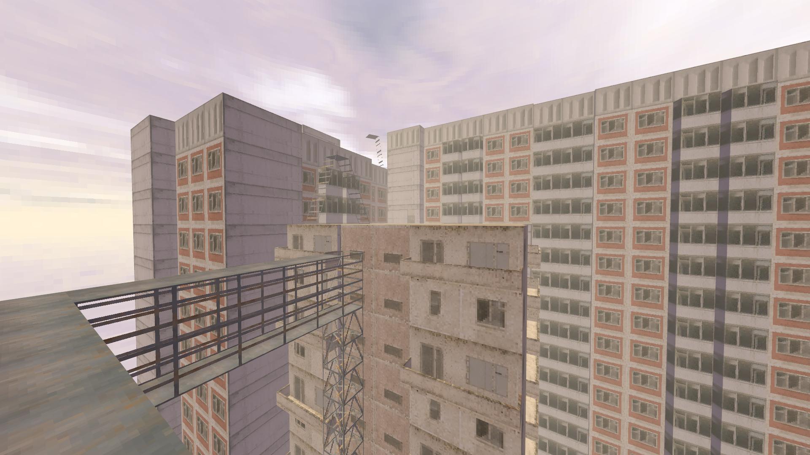
  
  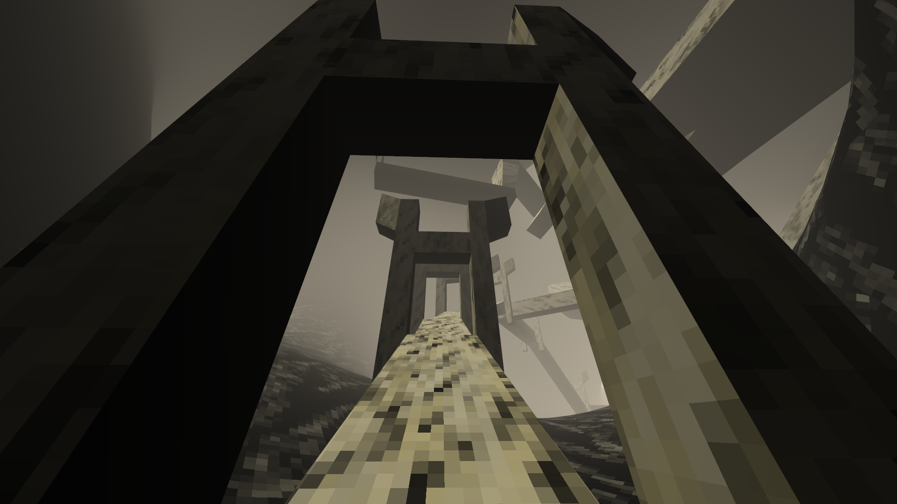
  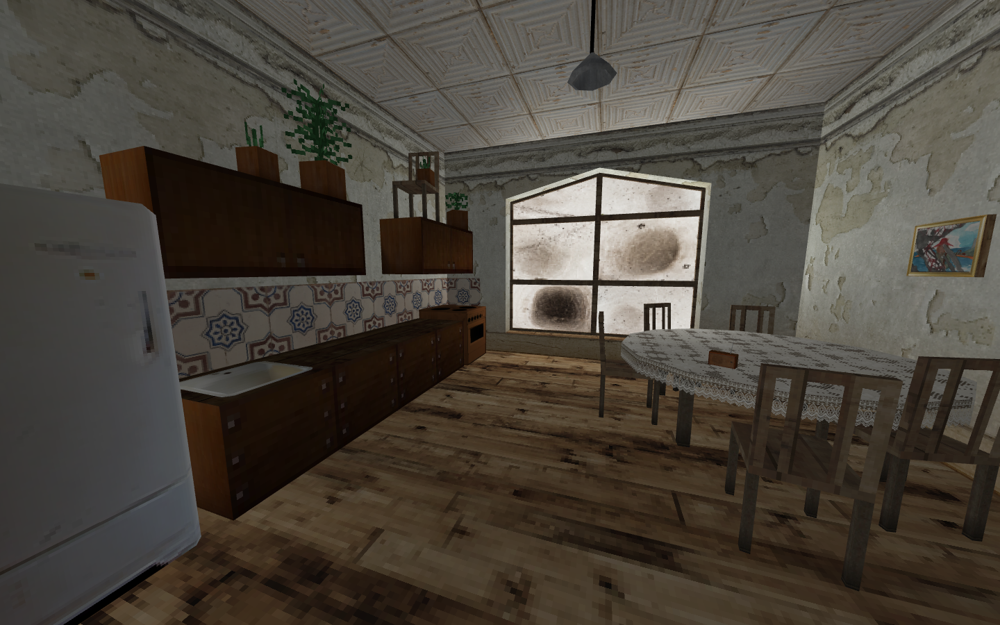
  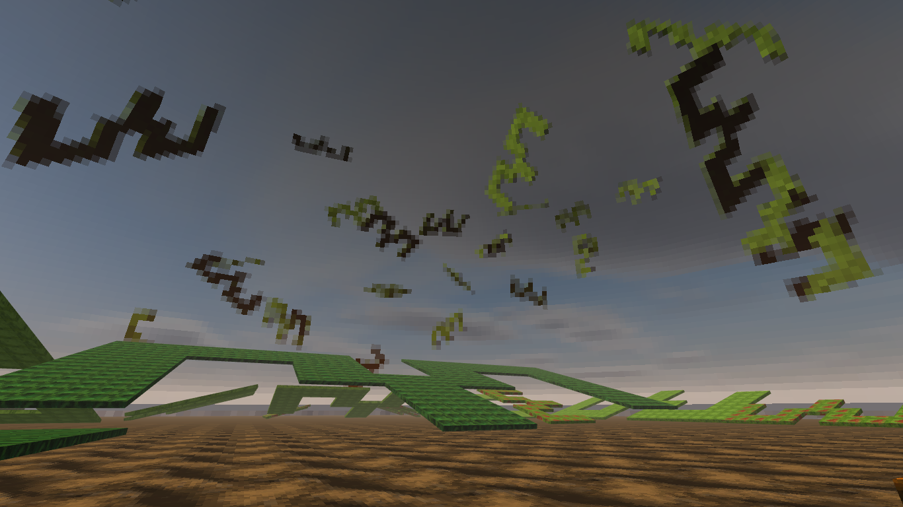
  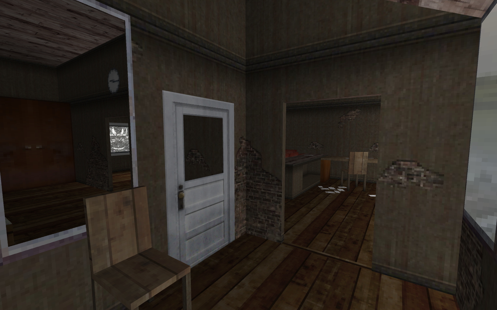

